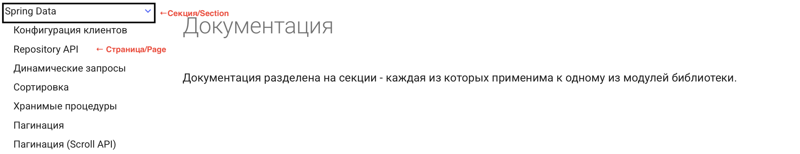
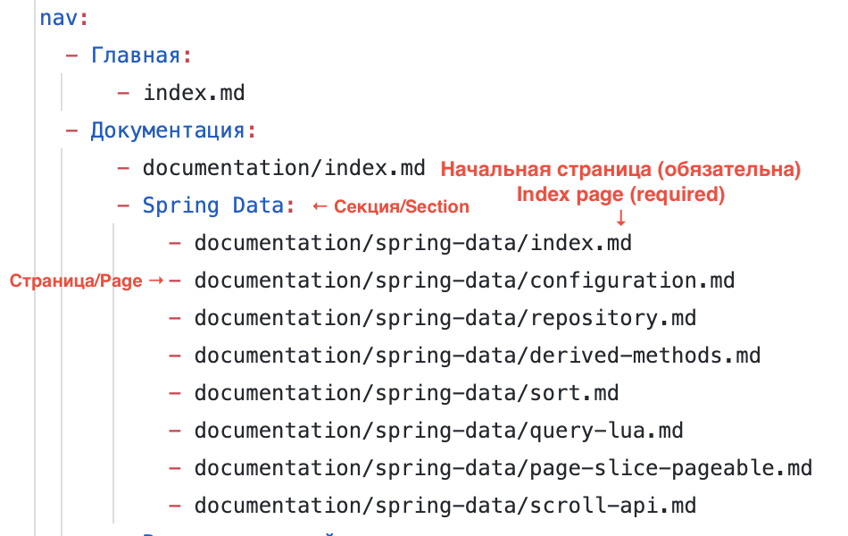

## Documentation

### Local documentation deploy

To deploy documentation locally on current branch/tag:

1. Checkout branch/tag and initialize python-environment:

    ```shell
    git checkout <branch/tag>
    cd documentation
    python3 -m venv venv
    source venv/bin/activate
    pip install -r requirements.txt
    ```

2. Build or serve site:

   ```shell
   mkdocs build
   ```

   ```shell
   mkdocs serve
    ```

### Internationalization

Documentation supports two languages:

- Russian 🇷🇺 - by default
- English 🇺🇸

### New pages writing rules

#### Section

`Section` is group of pages, describing one certain topic. Section can include subsections. Write
section on separate directory. Each section must have page with `index.md` name that describe topic
area.

`Page` is page with any name and `.md` extension.

When a new section and page are being written, they should be added to the `nav` section in the
`mkdocs.yml` file.

Section example:

> 

Example of a decorated navigation for this section:

> 

### Схемы

#### Plantuml

The documentation supports the rendering of `plantuml diagrams`. To add the plantuml schema to the
text of the `markdown` page, use a block of code with the `puml` extension.:

> \`\`\`puml
>
> @startuml
>
> Alice -> Bob: test
>
> @enduml
>
> \`\`\`

#### Drawio

The documentation supports the display of diagrams written in `drawio` (files with the `.drawio`
extension). It is necessary to add the schema to the `assets` directory. In the Markdown text, add a
diagram in the same way as you add an image using a relative path:

```markdown

```

### Code Snippets

The documentation supports adding text inclusions from other files (snippets) to the Markdown text.
To add snippet to the Markdown text, read the
extension's [documentation](https://facelessuser.github.io/pymdown-extensions/extensions/snippets/).
The path to the files to be included is calculated relative to the `docs/documentation/examples`
directory.

#### Additional extensions

- Usage of [emoji](https://squidfunk.github.io/mkdocs-material/reference/icons-emojis/) in Markdown
  pages
- [Tabs of content](https://squidfunk.github.io/mkdocs-material/reference/content-tabs/)
- [Footnotes](https://squidfunk.github.io/mkdocs-material/reference/footnotes/)
- [Mermaid diagrams](https://squidfunk.github.io/mkdocs-material/reference/diagrams/)
- [Admonitions](https://squidfunk.github.io/mkdocs-material/reference/admonitions/)
- [Annotations](https://squidfunk.github.io/mkdocs-material/reference/annotations/)
