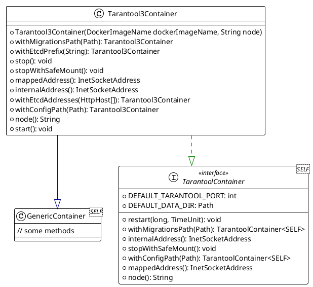
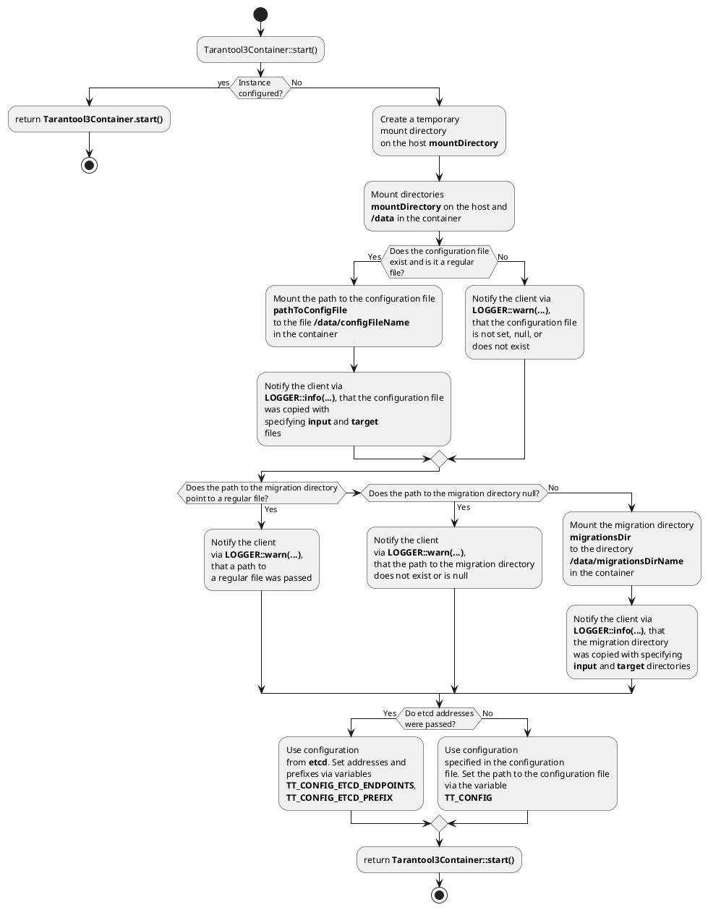

## Standard Implementation of the `TarantoolContainer` Interface

This page describes the standard implementation of the `TarantoolContainer` interface.

### Class Diagram



The `Tarantool3Container` class allows you to create a `Tarantool 3.x` container object that satisfies the [contract](single-node-testcontainers-arch.md) of `TarantoolContainer`.

### Implementation Description

#### Mounting Directories and Files Location

The implementation ensures the following behavior when configuring the container:



#### Ensuring Mounted Data Preservation

According to the `TarantoolContainer` contract, when calling the `TarantoolContainer::stopWithSafeMount()` method and then calling `TarantoolContainer::start()` again, the mounted data must be preserved. `Tarantool3Container` implements this mechanism as follows:

=== "Tarantool3Container::start()"

    ```puml
    @startuml
    start
    if(Is the container closed via <b>Tarantool3Container::stop()</b>?) then (Yes)
      :Throw an exception;
      end
    else(No)
      if (Is the container already configured?) then(Yes)
      else (No)
        :Configure the container;
        :Mark that the container is configured;
      endif
    endif
    :return <b>Tarantool3Container::start()</b>;
    stop
    @enduml
    ```

=== "Tarantool3Container::stopWithSafeMount()"

    ```puml
    @startuml
    start
    if(Is the container closed via Tarantool3Container::stop()?) then (Yes)
    else(No)
      :Stop the container;
    endif
    :return <b>Tarantool3Container::stopWithSafeMount()</b>;
    stop
    @enduml
    ```

=== "Tarantool3Container::stop()"

    ```puml
    @startuml
    start
    if(Is the container closed via Tarantool3Container::stop()?) then (Yes)
    else(No)
      :Delete mounted directories;
      :Stop the container;
      :Mark that the container is stopped;
    endif
    :return <b>Tarantool3Container::stop()</b>;
    stop
    @enduml
    ```

Mounted directories are deleted only when calling the `Tarantool3Container::stop()` method. Container configuration occurs only once during the first call to `Tarantool3Container::start()`.

### Port Binding

Port binding is not performed at the container configuration stage. Port binding is performed after the container starts `Tarantool3Container::start()`.
