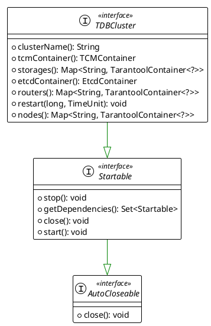
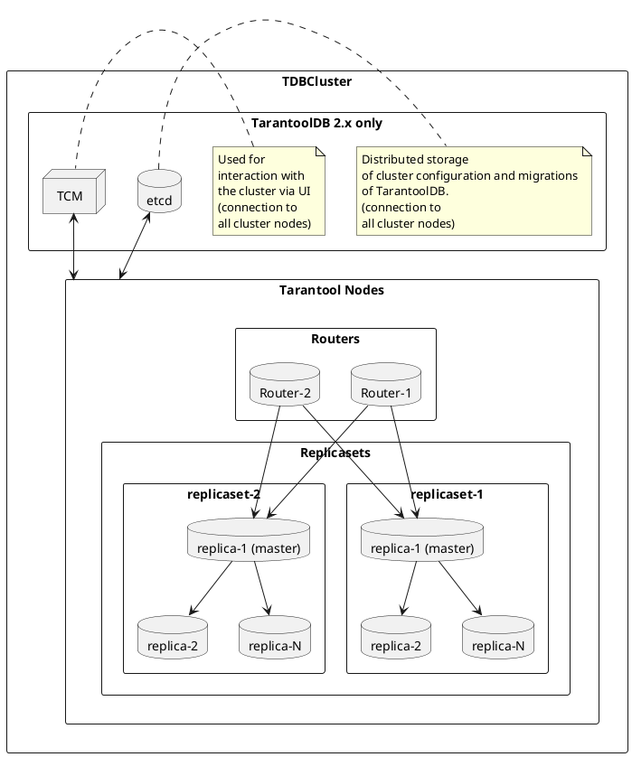

## TDBCluster

The main interface for working with a [TarantoolDB](https://www.tarantool.io/en/tarantooldb/doc/latest/) cluster within `testcontainers` is `TDBCluster`:



## Requirements for Interface Implementations

### TDB Cluster Components

Depending on the `TarantoolDB(TDB)` version, the cluster may contain various components (containers) necessary for its operation:



### Restarting the Cluster

Cluster restart is performed using the `void restart(long delay, TimeUnit unit)` method, where `delay` is the wait duration, and `unit` defines the measurement unit of `delay`. Implementations must ensure that mounted data is preserved when using this method.

### Stopping the Cluster

Stopping the cluster with closing all resources is performed using the `stop()` and `close()` methods:

```java
import org.junit.Test;
import org.testcontainers.containers.tdb.TDBCluster;
import org.testcontainers.utility.DockerImageName;

public class TestClass {

  @Test
  public void method() {
    final DockerImageName image = DockerImageName.parse("tarantooldb:2.2.1");

    try (TDBCluster cluster = new SomeTDBClusterImplementation()) {
      cluster.start();
      cluster.start(); //valid. idempotency

    } // call `close()` method of AutoCloseable interface
  }
}
```

```java

import org.junit.Test;
import org.testcontainers.containers.tdb.TDBCluster;
import org.testcontainers.utility.DockerImageName;

public class TestClass {

  @Test
  public void method() {
    final DockerImageName image = DockerImageName.parse("tarantooldb:2.1.1");

    try (TDBCluster cluster = new SomeTDBClusterImplementation()) {
      cluster.start();

      cluster.stop();
      cluster.stop(); // valid. idempotency
      
      // Uncomment to see the exception
      // cluster.start(); // invalid. Throws `already closed` exception
    }
  }
}
```

### Port Binding

After starting the cluster, each `TDBCluster` component (containers) is assigned a free external port. Implementations must guarantee that the assigned ports will be retained for containers until the `close()` or `stop()` methods are called.
