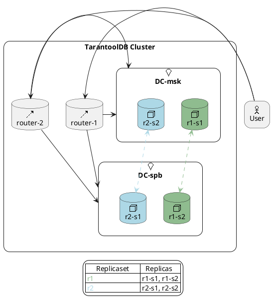

## Example 1. Starting a TDB Cluster Without Configuration Definition

In this example, we consider the case of starting a `TDB 2.x` cluster with standard settings, defining the number of routers, shards, and replicas in them, without passing custom settings and migrations.

The standard configuration looks like this (generated automatically by the `TDB2Cluster` class):

```yaml
---
credentials:
  users:
    test-super:
      password: "test"
      roles:
        - "super"
    storage:
      password: "secret"
      roles:
        - "sharding"
    replicator:
      password: "secret"
      roles:
        - "replication"
groups:
  # Routers group  
  routers:
    # The number of router instances varies depending on the `routerCount` parameter
    replicasets:
      router-1:
        leader: "router-1"
        instances:
          # <instance_name>
          router-0:
            iproto:
              listen:
                # hostname must be identical to <instance_name>
                - uri: "router-1:3301"
              advertise:
                client: "router-1:3301"
    replication:
      failover: "manual"
    roles:
      - "roles.crud-router"
    sharding:
      roles:
        - "router"
  storages:
    # Shard count determined by the `shardCount` parameter   
    replicasets:
      # description: replicaset-1
      r1:
        # Replica count determined by the `replicaCount` parameter
        instances:
          # description: replicaset-1 storage-1
          r1-s1:
            iproto:
              listen:
                - uri: "r1-s1:3301"
              advertise:
                client: "r1-s1:3301"
    replication:
      failover: "election"
    roles:
      - "roles.crud-storage"
    sharding:
      roles:
        - "storage"
iproto:
  advertise:
    peer:
      login: "replicator"
    sharding:
      login: "storage"
```

### Step 1. Starting the Cluster

In this step, we demonstrate the simplest way to start a TDB 2.x cluster by specifying the number of different cluster components (routers, shards, replicas) without passing custom settings and migrations.

```java
import java.util.Arrays;
import java.util.Collections;
import java.util.List;

import com.github.dockerjava.api.DockerClient;
import com.github.dockerjava.api.model.Container;
import org.junit.Test;
import org.slf4j.Logger;
import org.slf4j.LoggerFactory;
import org.testcontainers.DockerClientFactory;
import org.testcontainers.containers.tdb.TDB2ClusterImpl;
import org.testcontainers.containers.tdb.TDBCluster;

public class TestClass {

  private static final Logger LOG = LoggerFactory.getLogger(TestClass.class);

  @Test
  public void testSimpleClusterWithoutMigrations() {
    try (TDBCluster cluster = TDB2ClusterImpl.builder("tarantooldb:2.2.1")
        .withRouterCount(1)
        .withShardCount(2)
        .withReplicaCount(2)
        .build()) {

      cluster.start();
      final DockerClient dockerClient = DockerClientFactory.instance().client();

      List<Container> running = dockerClient.listContainersCmd()
          .withStatusFilter(Collections.singletonList("running")).exec();
      running.forEach(
          c -> LOG.info("\n\t---\n\tID: {}\n\tImage: {}\n\tStatus: {}\n\tNames: {}\n\t---",
              c.getImage(), c.getImage(),
              c.getStatus(), Arrays.toString(c.getNames())));
    }
  }
}
```

As a result of the execution, you should get the following logs:

```
...
14:20:18.280 [main] INFO  o.t.c.tdb.TDB2ClusterImplTest - 
	---
	ID: tarantooldb:2.2.1
	Image: tarantooldb:2.2.1
	Status: Up 5 seconds
	Names: [/r2-s2-de28a37f-cf2d-4420-9e23-ffb2bcab5892]
	---
14:20:18.280 [main] INFO  o.t.c.tdb.TDB2ClusterImplTest - 
	---
	ID: tarantooldb:2.2.1
	Image: tarantooldb:2.2.1
	Status: Up 5 seconds
	Names: [/router-1-de28a37f-cf2d-4420-9e23-ffb2bcab5892]
	---
14:20:18.280 [main] INFO  o.t.c.tdb.TDB2ClusterImplTest - 
	---
	ID: tarantooldb:2.2.1
	Image: tarantooldb:2.2.1
	Status: Up 5 seconds
	Names: [/r1-s2-de28a37f-cf2d-4420-9e23-ffb2bcab5892]
	---
14:20:18.280 [main] INFO  o.t.c.tdb.TDB2ClusterImplTest - 
	---
	ID: tarantooldb:2.2.1
	Image: tarantooldb:2.2.1
	Status: Up 5 seconds
	Names: [/r2-s1-de28a37f-cf2d-4420-9e23-ffb2bcab5892]
	---
14:20:18.280 [main] INFO  o.t.c.tdb.TDB2ClusterImplTest - 
	---
	ID: tarantooldb:2.2.1
	Image: tarantooldb:2.2.1
	Status: Up 5 seconds
	Names: [/r1-s1-de28a37f-cf2d-4420-9e23-ffb2bcab5892]
	---
14:20:18.280 [main] INFO  o.t.c.tdb.TDB2ClusterImplTest - 
	---
	ID: tarantooldb:2.2.1
	Image: tarantooldb:2.2.1
	Status: Up 6 seconds
	Names: [/TCM-de28a37f-cf2d-4420-9e23-ffb2bcab5892]
	---
14:20:18.280 [main] INFO  o.t.c.tdb.TDB2ClusterImplTest - 
	---
	ID: quay.io/coreos/etcd:v3.5.14
	Image: quay.io/coreos/etcd:v3.5.14
	Status: Up 7 seconds
	Names: [/ETCD-de28a37f-cf2d-4420-9e23-ffb2bcab5892]
	---
14:20:18.280 [main] INFO  o.t.c.tdb.TDB2ClusterImplTest - 
	---
	ID: testcontainers/ryuk:0.11.0
	Image: testcontainers/ryuk:0.11.0
	Status: Up 7 seconds
	Names: [/testcontainers-ryuk-bc5fcb58-e84a-443c-b819-92c0ebeab6ff]
	---
...
```

### Step 2. Applying Migrations

In this step, we demonstrate how to apply migrations in a test cluster. The TDB 2.x cluster topology is the same as in the previous example.

First, let's define the migrations. To do this, create a directory `migrations/scenario` (in an arbitrary location). In the `migrations/scenario` directory, define the migration `001_kv.lua`:

```lua
local config = require('config')
local helpers = require('tt-migrations.helpers')
local fun = require('fun')

local function is_router()
  return fun.index('roles.crud-router', config:get('roles')) ~= nil
end

local function is_storage()
  return fun.index('roles.crud-storage', config:get('roles')) ~= nil
end

local function apply()
    if is_router() then
        box.schema.func.create('hello', {
            language = 'LUA',
            if_not_exists = true,
            body = [[
                function(name)
                    return string.format("hello %s", tostring(name))
                end
            ]],
        })
    end

    if is_storage() then
        box.schema.space.create('kv', { if_not_exists = true })
        box.space.kv:format({
            { name = 'id', type = 'number' },
            { name = 'bucket_id', type = 'unsigned' },
            { name = 'kv', type = 'any' },
        })
        box.space.kv:create_index('pk', { parts = {'id'}, if_not_exists = true})
        box.space.kv:create_index('bucket_id', { parts = {'bucket_id'}, unique = false, if_not_exists = true})
        helpers.register_sharding_key('kv', {'id'})
    end

    return true
end

return {
    apply = {
        scenario = apply,
    }
}
```

Start the cluster with passing migrations and verify that the migrations were applied:

```java
import java.io.IOException;
import java.nio.file.Path;
import java.nio.file.Paths;
import java.util.Map;
import java.util.Map.Entry;

import org.junit.Test;
import org.testcontainers.containers.Container.ExecResult;
import org.testcontainers.containers.tarantool.TarantoolContainer;
import org.testcontainers.containers.tdb.TDB2ClusterImpl;
import org.testcontainers.containers.tdb.TDBCluster;

public class TestClass {

  // put your migrations location
  private static final Path PATH_TO_MIGRATIONS = Paths.get("<your_location>", "migrations");

  private static final String USER = "test-super";

  private static final String PASSWORD = "test";

  private static final String ROUTER_COMMAND = "echo \"box.schema.func.call('hello')\" | tt connect %s:%s@%s:%s -x lua";

  private static final String STORAGE_COMMAND = "echo \"box.space.kv ~= nil\" | tt connect %s:%s@%s:%s -x lua";

  @Test
  public void testSimpleClusterWithMigration() throws IOException, InterruptedException {
    try (final TDBCluster cluster = TDB2ClusterImpl.builder("tarantooldb:2.2.1")
        .withRouterCount(1)
        .withShardCount(2)
        .withReplicaCount(2)
        .withMigrationsDirectory(PATH_TO_MIGRATIONS)
        .build()) {
      cluster.start();

      final Map<String, TarantoolContainer<?>> routers = cluster.routers();
      assertFalse(routers.isEmpty());

      for (final Entry<String, TarantoolContainer<?>> router : routers.entrySet()) {
        final ExecResult execResult = router.getValue().execInContainer("/bin/sh", "-c",
            String.format(ROUTER_COMMAND, USER, PASSWORD, router.getKey(),
                TarantoolContainer.DEFAULT_TARANTOOL_PORT));

        assertEquals(0, execResult.getExitCode());
        assertEquals("\"hello nil\";\n", execResult.getStdout());
      }

      final Map<String, TarantoolContainer<?>> storages = cluster.storages();
      assertFalse(storages.isEmpty());

      for (final Entry<String, TarantoolContainer<?>> storage : storages.entrySet()) {
        final ExecResult execResult = storage.getValue().execInContainer("/bin/sh", "-c",
            String.format(STORAGE_COMMAND, USER, PASSWORD, storage.getKey(),
                TarantoolContainer.DEFAULT_TARANTOOL_PORT));

        assertEquals(0, execResult.getExitCode());
        assertEquals("true;\n", execResult.getStdout());
      }
    }
  }
}
```

## Example 2. Starting a Cluster with Custom Settings

To define cluster settings, you can use the `Tarantool3Configuration` class.

Suppose you want to start a cluster with 2 routers (router), 2 storage replicasets (storage), each with two replicas (master and slave):

```yaml
---
credentials:
  users:
    test-super:
      password: "test"
      roles:
        - "super"
    storage:
      password: "secret"
      roles:
        - "sharding"
    replicator:
      password: "secret"
      roles:
        - "replication"
groups:
  routers:
    replicasets:
      router-1:
        leader: "router-1"
        instances:
          router-1:
            iproto:
              listen:
                - uri: "router-1:3301"
              advertise:
                client: "router-1:3301"
      router-2:
        leader: "router-2"
        instances:
          router-2:
            iproto:
              listen:
                - uri: "router-2:3301"
              advertise:
                client: "router-2:3301"
    replication:
      failover: "manual"
    roles:
      - "roles.crud-router"
    sharding:
      roles:
        - "router"
  storages:
    replicasets:
      r1:
        instances:
          r1-s1:
            iproto:
              listen:
                - uri: "r1-s1:3301"
              advertise:
                client: "r1-s1:3301"
          r1-s2:
            iproto:
              listen:
                - uri: "r1-s2:3301"
              advertise:
                client: "r1-s2:3301"
      r2:
        instances:
          r2-s1:
            iproto:
              listen:
                - uri: "r2-s1:3301"
              advertise:
                client: "r2-s1:3301"
          r2-s2:
            iproto:
              listen:
                - uri: "r2-s2:3301"
              advertise:
                client: "r2-s2:3301"
    replication:
      failover: "election"
    roles:
      - "roles.crud-storage"
    sharding:
      roles:
        - "storage"
iproto:
  advertise:
    peer:
      login: "replicator"
    sharding:
      login: "storage"
```

Graphical representation of the topology:



Define the configuration above using `Tarantool3Configuration`:

```java
import java.util.Arrays;
import java.util.Collections;
import java.util.List;
import java.util.Map;
import java.util.Set;

import org.junit.jupiter.api.Assertions;
import org.junit.jupiter.api.Test;
import org.testcontainers.containers.tarantool.TarantoolContainer;
import org.testcontainers.containers.tdb.TDB2ClusterImpl;
import org.testcontainers.containers.tdb.TDBCluster;

import io.tarantool.autogen.Tarantool3Configuration;
import io.tarantool.autogen.credentials.Credentials;
import io.tarantool.autogen.credentials.users.Users;
import io.tarantool.autogen.credentials.users.usersProperty.UsersProperty;
import io.tarantool.autogen.groups.Groups;
import io.tarantool.autogen.groups.groupsProperty.GroupsProperty;
import io.tarantool.autogen.groups.groupsProperty.replicasets.Replicasets;
import io.tarantool.autogen.groups.groupsProperty.replicasets.replicasetsProperty.ReplicasetsProperty;
import io.tarantool.autogen.groups.groupsProperty.replicasets.replicasetsProperty.instances.Instances;
import io.tarantool.autogen.groups.groupsProperty.replicasets.replicasetsProperty.instances.instancesProperty.InstancesProperty;
import io.tarantool.autogen.groups.groupsProperty.replicasets.replicasetsProperty.instances.instancesProperty.iproto.Iproto;
import io.tarantool.autogen.groups.groupsProperty.replicasets.replicasetsProperty.instances.instancesProperty.iproto.advertise.Advertise;
import io.tarantool.autogen.groups.groupsProperty.replicasets.replicasetsProperty.instances.instancesProperty.iproto.listen.Listen;
import io.tarantool.autogen.groups.groupsProperty.replication.Replication;
import io.tarantool.autogen.groups.groupsProperty.replication.Replication.Failover;
import io.tarantool.autogen.groups.groupsProperty.sharding.Role;
import io.tarantool.autogen.groups.groupsProperty.sharding.Sharding;
import io.tarantool.autogen.iproto.advertise.peer.Peer;

public class TestClass {

  // this user must be always for TCM
  private static final CharSequence TEST_USER_PWD = "test";
  private static final String TEST_USER = "test-super";
  private static final String URI_FORMAT = "%s:" + TarantoolContainer.DEFAULT_TARANTOOL_PORT;

  @Test
  public void testCustomConfigurationCluster() {

    // introduce configuration
    final io.tarantool.autogen.iproto.Iproto gIproto = io.tarantool.autogen.iproto.Iproto.builder()
        .withAdvertise(io.tarantool.autogen.iproto.advertise.Advertise.builder()
            .withPeer(Peer.builder()
                .withLogin("replicator")
                .build())
            .withSharding(io.tarantool.autogen.iproto.advertise.sharding.Sharding.builder()
                .withLogin("storage")
                .build())
            .build())
        .build();

    final UsersProperty testUser = UsersProperty.builder()
        .withPassword(TEST_USER_PWD.toString())
        .withRoles(Collections.singletonList("super"))
        .build();
    final UsersProperty replicatorUser = UsersProperty.builder()
        .withPassword("secret")
        .withRoles(Collections.singletonList("replication"))
        .build();

    final UsersProperty storageUser = UsersProperty.builder()
        .withPassword("secret")
        .withRoles(Collections.singletonList("sharding"))
        .build();

    final Credentials gCredentials = Credentials.builder()
        .withUsers(Users.builder()
            .withAdditionalProperty(TEST_USER, testUser)
            .withAdditionalProperty("replicator", replicatorUser)
            .withAdditionalProperty("storage", storageUser)
            .build())
        .build();

    // introduce routers
    final String firstRouterInstanceName = "router-1";
    final String secondRouterInstanceName = "router-2";

    final String firstRouterUri = String.format(URI_FORMAT, firstRouterInstanceName);
    final String secondRouterUri = String.format(URI_FORMAT, secondRouterInstanceName);

    final InstancesProperty firstRouter = InstancesProperty.builder()
        .withIproto(Iproto.builder()
            .withListen(List.of(Listen.builder().withUri(firstRouterUri).build()))
            .withAdvertise(Advertise.builder()
                .withClient(firstRouterUri)
                .build())
            .build())
        .build();

    final ReplicasetsProperty firstRouterRs = ReplicasetsProperty.builder()
        .withLeader(firstRouterInstanceName)
        .withInstances(Instances.builder()
            .withAdditionalProperty(firstRouterInstanceName, firstRouter)
            .build())
        .build();

    final InstancesProperty secondRouter = InstancesProperty.builder()
        .withIproto(Iproto.builder()
            .withListen(List.of(Listen.builder().withUri(secondRouterUri).build()))
            .withAdvertise(Advertise.builder()
                .withClient(secondRouterUri)
                .build())
            .build())
        .build();

    final ReplicasetsProperty secondRouterRs = ReplicasetsProperty.builder()
        .withLeader(secondRouterInstanceName)
        .withInstances(Instances.builder()
            .withAdditionalProperty(secondRouterInstanceName, secondRouter)
            .build())
        .build();

    final GroupsProperty routersGroup = GroupsProperty.builder()
        .withReplicasets(Replicasets.builder()
            .withAdditionalProperty(firstRouterInstanceName, firstRouterRs)
            .withAdditionalProperty(secondRouterInstanceName, secondRouterRs)
            .build())
        .withReplication(Replication.builder()
            .withFailover(Failover.MANUAL)
            .build())
        .withRoles(Collections.singletonList("roles.crud-router"))
        .withSharding(Sharding.builder()
            .withRoles(Collections.singleton(Role.ROUTER))
            .build())
        .build();

    // introduce r1 replicaset
    final String r1s1InstanceName = "r1-s1";
    final String r1s2InstanceName = "r1-s2";

    final String r1s1Uri = String.format(URI_FORMAT, r1s1InstanceName);
    final String r1s2Uri = String.format(URI_FORMAT, r1s2InstanceName);

    final InstancesProperty r1s1 = InstancesProperty.builder()
        .withIproto(Iproto.builder()
            .withListen(List.of(Listen.builder().withUri(r1s1Uri).build()))
            .withAdvertise(Advertise.builder().withClient(r1s1Uri).build())
            .build())
        .build();

    final InstancesProperty r1s2 = InstancesProperty.builder()
        .withIproto(Iproto.builder()
            .withListen(List.of(Listen.builder().withUri(r1s2Uri).build()))
            .withAdvertise(Advertise.builder().withClient(r1s2Uri).build())
            .build())
        .build();

    final ReplicasetsProperty r1 = ReplicasetsProperty.builder()
        .withInstances(Instances.builder()
            .withAdditionalProperty(r1s1InstanceName, r1s1)
            .withAdditionalProperty(r1s2InstanceName, r1s2)
            .build())
        .build();

    // introduce r2 replicaset
    final String r2s1InstanceName = "r2-s1";
    final String r2s2InstanceName = "r2-s2";

    final String r2s1Uri = String.format(URI_FORMAT, r2s1InstanceName);
    final String r2s2Uri = String.format(URI_FORMAT, r2s2InstanceName);

    final InstancesProperty r2s1 = InstancesProperty.builder()
        .withIproto(Iproto.builder()
            .withListen(List.of(Listen.builder().withUri(r2s1Uri).build()))
            .withAdvertise(Advertise.builder().withClient(r2s1Uri).build())
            .build())
        .build();

    final InstancesProperty r2s2 = InstancesProperty.builder()
        .withIproto(Iproto.builder()
            .withListen(List.of(Listen.builder().withUri(r2s2Uri).build()))
            .withAdvertise(Advertise.builder().withClient(r2s2Uri).build())
            .build())
        .build();

    final ReplicasetsProperty r2 = ReplicasetsProperty.builder()
        .withInstances(Instances.builder()
            .withAdditionalProperty(r2s1InstanceName, r2s1)
            .withAdditionalProperty(r2s2InstanceName, r2s2)
            .build())
        .build();

    final GroupsProperty storagesGroup = GroupsProperty.builder()
        .withReplicasets(Replicasets.builder()
            .withAdditionalProperty("r1", r1)
            .withAdditionalProperty("r2", r2)
            .build())
        .withReplication(Replication.builder()
            .withFailover(Failover.ELECTION)
            .build())
        .withRoles(Collections.singletonList("roles.crud-storage"))
        .withSharding(Sharding.builder()
            .withRoles(Collections.singleton(Role.STORAGE))
            .build())
        .build();

    // introduce configuration
    final Tarantool3Configuration configuration = Tarantool3Configuration.builder()
        .withCredentials(gCredentials)
        .withGroups(Groups.builder()
            .withAdditionalProperty("routers", routersGroup)
            .withAdditionalProperty("storages", storagesGroup)
            .build())
        .withIproto(gIproto)
        .build();

    // check cluster
    try (final TDBCluster cluster = TDB2ClusterImpl.builder("tarantooldb:2.2.1")
        // it will use configuration object for cluster configuration instead of replicaCount and etc
        .withTDB2Configuration(configuration)
        .build()) {
      cluster.start();

      final Map<String, TarantoolContainer<?>> routers = cluster.routers();
      Assertions.assertEquals(2, routers.size());

      for (final String instanceName : Arrays.asList(firstRouterInstanceName,
          secondRouterInstanceName)) {
        Assertions.assertTrue(routers.containsKey(instanceName));
      }

      final Map<String, TarantoolContainer<?>> storages = cluster.storages();
      Assertions.assertEquals(4, storages.size());

      for (final String instanceName : Arrays.asList(r1s1InstanceName, r2s1InstanceName,
          r2s2InstanceName, r1s2InstanceName)) {
        Assertions.assertTrue(storages.containsKey(instanceName));
      }
    }
  }
}
```

## Example 3. Starting a Cluster with Custom Settings

Suppose you already have a configuration file:

```yaml
---
credentials:
  users:
    test-super:
      password: "test"
      roles:
        - "super"
    storage:
      password: "secret"
      roles:
        - "sharding"
    replicator:
      password: "secret"
      roles:
        - "replication"
groups:
  routers:
    replicasets:
      router-1:
        leader: "router-1"
        instances:
          router-1:
            iproto:
              listen:
                - uri: "router-1:3301"
              advertise:
                client: "router-1:3301"
      router-2:
        leader: "router-2"
        instances:
          router-2:
            iproto:
              listen:
                - uri: "router-2:3301"
              advertise:
                client: "router-2:3301"
    replication:
      failover: "manual"
    roles:
      - "roles.crud-router"
    sharding:
      roles:
        - "router"
  storages:
    replicasets:
      r1:
        instances:
          r1-s1:
            iproto:
              listen:
                - uri: "r1-s1:3301"
              advertise:
                client: "r1-s1:3301"
          r1-s2:
            iproto:
              listen:
                - uri: "r1-s2:3301"
              advertise:
                client: "r1-s2:3301"
      r2:
        instances:
          r2-s1:
            iproto:
              listen:
                - uri: "r2-s1:3301"
              advertise:
                client: "r2-s1:3301"
          r2-s2:
            iproto:
              listen:
                - uri: "r2-s2:3301"
              advertise:
                client: "r2-s2:3301"
    replication:
      failover: "election"
    roles:
      - "roles.crud-storage"
    sharding:
      roles:
        - "storage"
iproto:
  advertise:
    peer:
      login: "replicator"
    sharding:
      login: "storage"
```

To use it, we'll use `YamlMapper`:

```java
import java.nio.file.Path;
import java.nio.file.Paths;
import java.util.Arrays;
import java.util.List;
import java.util.Map;

import org.junit.jupiter.api.Assertions;
import org.junit.jupiter.api.Test;
import org.testcontainers.containers.tarantool.TarantoolContainer;
import org.testcontainers.containers.tarantool.config.ConfigurationUtils;
import org.testcontainers.containers.tdb.TDB2ClusterImpl;
import org.testcontainers.containers.tdb.TDBCluster;

import io.tarantool.autogen.Tarantool3Configuration;

public class TestClass {

  private static final Path PATH_TO_CONFIG_FILE = Paths.get("<path_to_your_config_file>");

  private static final List<String> ROUTER_NAMES = Arrays.asList("router-1", "router-2");

  private static final List<String> STORAGES_NAMES =
          Arrays.asList("r1-s1", "r1-s2", "r2-s1", "r2-s2");

  @Test
  public void testClusterFileConfiguration() {
    final Tarantool3Configuration configuration = ConfigurationUtils.readFromFile(PATH_TO_CONFIG_FILE);

    // check cluster
    try (final TDBCluster cluster = TDB2ClusterImpl.builder("tarantooldb:2.2.1")
            // it will use configuration object for cluster configuration instead of replicaCount and etc
            .withTDB2Configuration(configuration)
            .build()) {
      cluster.start();

      final Map<String, TarantoolContainer<?>> routers = cluster.routers();
      Assertions.assertEquals(2, routers.size());

      for (final String instanceName : ROUTER_NAMES) {
        Assertions.assertTrue(routers.containsKey(instanceName));
      }

      final Map<String, org.testcontainers.containers.tarantool.TarantoolContainer<?>> storages = cluster.storages();
      Assertions.assertEquals(4, storages.size());

      for (final String instanceName : STORAGES_NAMES) {
        Assertions.assertTrue(storages.containsKey(instanceName));
      }
    }
  }
}
```

???+ warning "Important"

    * For `testcontainers` to work, the configuration must contain the user `test-super` with password
      `secret` and role `super`
    * `iproto.listen.uri` must have `hostname` identical to the instance name
      `instances.<instance_name>`
    * Web UI `TCM` login and password:
        * Login: `admin`
        * Password: `secret`
