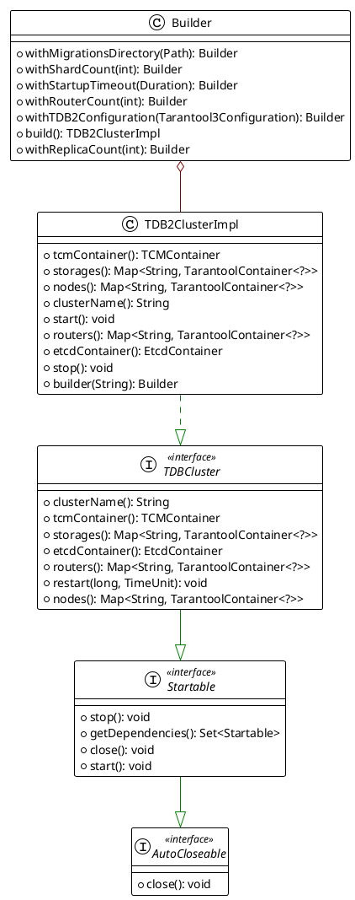
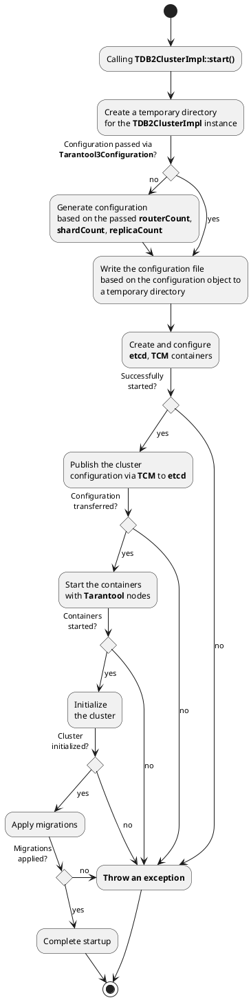
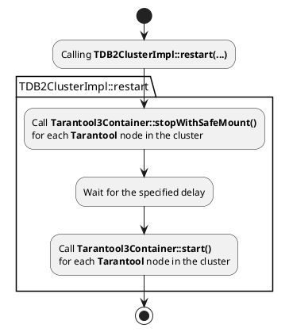

This page describes the standard implementation of the `TDBCluster` interface for `TDB 2.x`.

## Class Diagram

The `TDB2ClusterImpl` class allows you to create an object managing the lifecycle of a TDB 2.x cluster, satisfying the [contract](tdb-cluster-testcontainers-arch.md) of `TDBCluster`.

## Implementation Description

### Cluster Configuration

The implementation follows the following algorithm when configuring the cluster:

#### Ensuring Mounted Data Preservation

According to the `TDBCluster` contract, when calling the `TDBCluster::restart(...)` method, the mounted data must be preserved. `TDB2ClusterImpl` implements this mechanism by using the `TarantoolContainer::stopWithSafeMount()` contract:

Mounted directories are deleted only when calling the `TDB2ClusterImpl::stop()` method. Container configuration occurs only once during the first call to `TDB2ClusterImpl::start()`.

### Port Binding

External port binding to cluster components (containers) occurs at the `TDB2ClusterImpl` instance startup stage.
