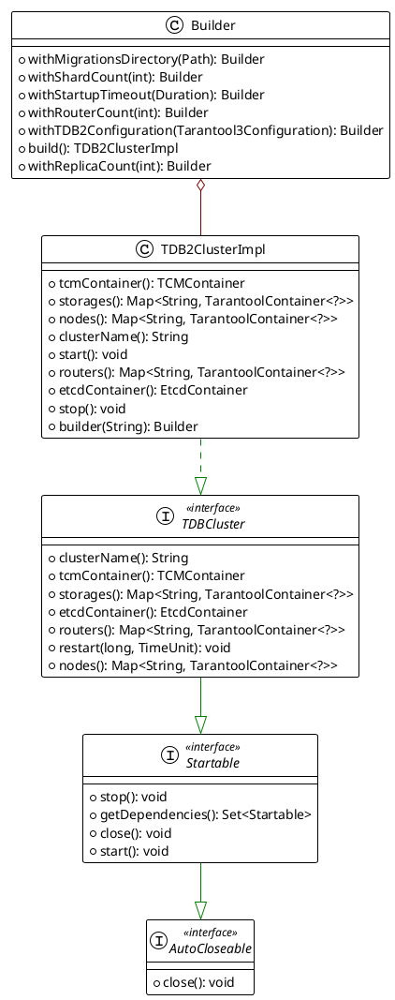
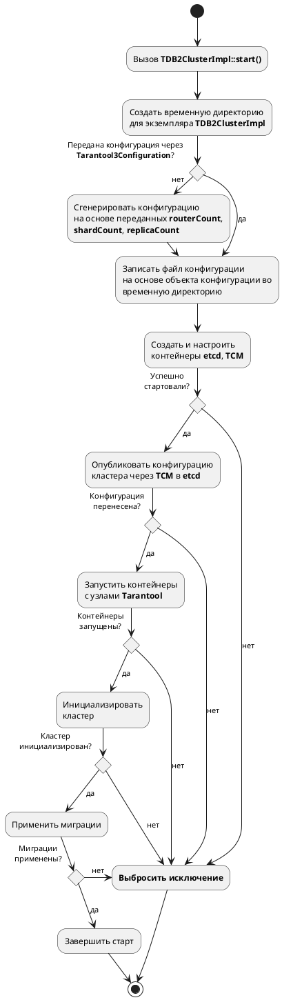
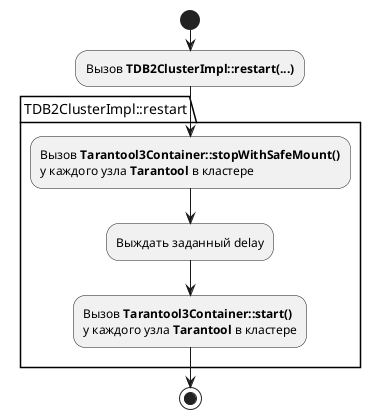

На странице приводится описание стандартной реализации интерфейса `TDBCluster` для `TDB 2.x`.

## Диаграмма классов

Класс `TDB2ClusterImpl` позволяет создать объект, управляющий жизненным циклом кластера TDB 2.x,
удовлетворяющий [контракту](tdb-cluster-testcontainers-arch.md) `TDBCluster`.

## Описание реализации

### Конфигурирование кластера

Реализация следует следующему алгоритму при конфигурации кластера:

#### Обеспечение сохранения монтируемых данных

Согласно контракту `TDBCluster` при вызове метода `TDBCluster::restart(...)` монтируемые данные
должны сохраниться. `TDB2ClusterImpl` реализует этот механизм за счет использования контракта
`TarantoolContainer::stopWithSafeMount()`:

Удаление монтируемых директорий происходит только при вызове метода `TDB2ClusterImpl::stop()`.
Конфигурирование контейнера происходит один раз при первом вызове `TDB2ClusterImpl::start()`.

### Привязка портов

Привязка внешних портов к компонентам кластера (контейнерам) происходит на этапе запуска экземпляра
`TDB2ClusterImpl`.
