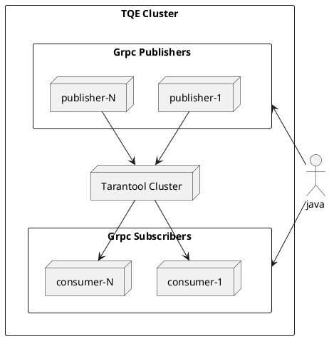

## TQE testcontainers

TQE testcontainers architecture:

`TQE testcontainers` are represented by the following interfaces:

- [TarantoolContainer](../single/single-node-testcontainers-arch.md) - used to create
  a Tarantool cluster
- [GrpcContainer](#grpccontainer) - used to create grpc nodes that can be either subscribers(consumer)
  or publishers(publisher)
- [TQECluster](#tqecluster) - used to start/restart and stop the TQE cluster
- [TQEConfigurator](#tqeconfigurator) - used to configure the TQE cluster

### GrpcContainer

`GrpcContainer` - all implementations of the interface represent containers that are grpc nodes. Each
node can have one or two roles as subscriber(consumer)/publisher(publisher).

#### GrpcContainerImpl

`GrpcContainerImpl` - the basic implementation of [GrpcContainer](#grpccontainer) that accepts a path to a configuration file for grpc nodes. The path must be a regular file and
correspond to the [rules](https://www.tarantool.io/ru/queue-enterprise/doc/latest/reference/#configuration)
for setting up a grpc node. The start and stop methods are idempotent. The object does not store state.

### TQECluster

`TQECluster` - an interface allowing to manage a TQE cluster. The interface allows to start and
stop the cluster (it is impossible to restart the cluster with the current instance after stopping),
and restart (preserving data in the TQE cluster).

#### TQEClusterImpl

`TQEClusterImpl` - the basic implementation of the [TQECluster](#tqecluster) interface, which is configured
using one of the [TQEConfigurator](#tqeconfigurator) instances.

### TQEConfigurator

`TQEConfigurator` - an interface that allows to configure TQE cluster nodes
([grpc nodes](#grpccontainer), [Tarantool cluster](../single/single-node-testcontainers-arch.md)).

#### FileTQEConfigurator

`FileTQEConfigurator` - the basic implementation of [TQEConfigurator](#tqeconfigurator) that allows
to configure TQE cluster nodes using configuration files. The configuration files must be
regular files and comply with the rules for setting up
[grpc nodes and Tarantool nodes for TQE](https://www.tarantool.io/ru/queue-enterprise/doc/latest/reference/#configuration)
