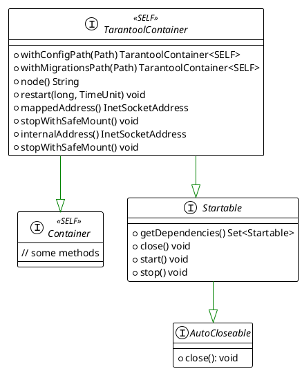
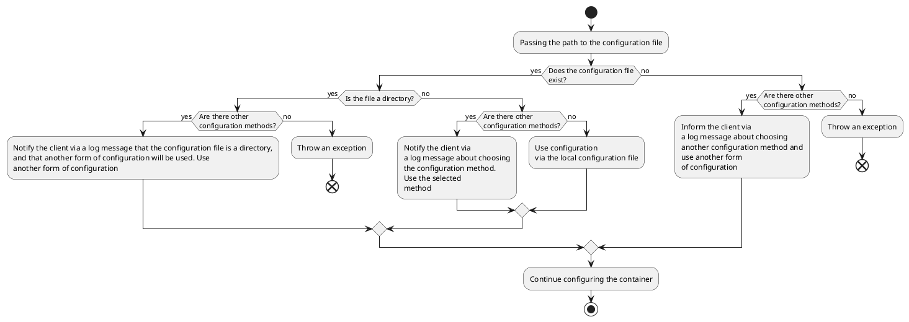
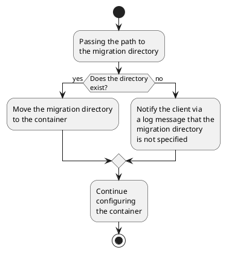

## Architecture

### TarantoolContainer

The main interface for working with a single `Tarantool` node is `TarantoolContainer`:



### Requirements for Interface Implementations

#### Mounting Directories and Files Location

All implementations of the interface must meet the following mounting directory and file requirements:

<table>
  <tr>
    <th>Host</th>
    <th>Container</th>
  </tr>
  <tr>
    <td><pre>
📁 temp_dir/
├─ 📄 config_file
└─ 📁 migration_dir/
    </pre></td>
    <td><pre>
📁 /data/
├─ 📄 config_file
└─ 📁 migration_dir/
    </pre></td>
  </tr>
</table>

The `/data` directory is the main directory inside the container. It stores the `Tarantool` process state, configuration files, and migrations. The mounted directory on the host corresponding to `/data` is chosen arbitrarily. `TT_WAL_DIR`, `TT_VYNIL_DIR`, `TT_SNAPSHOT_DIR`, `TT_MEMTX_DIR` must point to the `/data` directory.

#### Passing the Configuration File

Configuration file passing is performed via the `withConfigPath(Path path)` method, where `path` is the path to the configuration file. Implementations must comply with the following behavior:



#### Passing Migration Files

The migration directory must conform to the following format: `<migrations_dir>/scenario`. Migration files are placed in the `scenario` directory at the same level, without nesting:

```
📁 migrations_dir/
└─ 📁 scenario/
   ├─ 📄 001_migration.lua
   ├─ 📄 002_migration.lua
   ├─    ...
   └─ 📄 00N_migration.lua
```

The path to the migration directory is set via the `withMigrationsPath(Path path)` method. Implementations must comply with the following behavior:



The described contract does not impose requirements on the mandatory implementation of the [migration](https://www.tarantool.io/en/doc/latest/platform/ddl_dml/migrations/) mechanism, but obligates to mount the migration directory in the container.

#### Restarting the Container

Container restart is performed using the `void restart(long delay, TimeUnit unit)` method, where `delay` is the wait time, and `unit` defines the measurement unit of `delay`. Implementations must ensure that mounted data is preserved when using this method.

#### Stopping the Container

=== "With preserving mounted data"

    Stopping the container with preserving mounted data (equivalent to saving the `Tarantool` state) is performed using the idempotent method `void stopWithSafeMount()`:

    ```java
    import java.nio.file.Path;
    import java.nio.file.Paths;
    
    import org.junit.Test;
    import org.testcontainers.containers.tarantool.Tarantool3Container;
    import org.testcontainers.containers.tarantool.TarantoolContainer;
    import org.testcontainers.utility.DockerImageName;
    
    public class TestClass {
    
      @Test
      public void testCloseWithSafeMount() {
        final DockerImageName image = DockerImageName.parse("tarantool/tarantool:3.4.1");
        final Path pathToConfigFile = Paths.get("path/to/config.yaml");
    
        try (TarantoolContainer<Tarantool3Container> container = new Tarantool3Container(image,
            "some_node_name")
            .withConfigPath(pathToConfigFile)) {
          container.start(); // valid
          container.start(); // valid. Idempotency.
    
          container.stopWithSafeMount();
          container.stopWithSafeMount(); // idempotency
    
          container.start(); // start again
        } // call `close()` method of AutoCloseable interface
      }
    }
    ```

=== "Without preserving mounted data"

    ```java
    import java.nio.file.Path;
    import java.nio.file.Paths;
    
    import org.junit.Test;
    import org.testcontainers.containers.tarantool.Tarantool3Container;
    import org.testcontainers.containers.tarantool.TarantoolContainer;
    import org.testcontainers.utility.DockerImageName;
    
    public class TestClass {
    
      @Test
      public void testCloseWithRemoveMount() {
        final DockerImageName image = DockerImageName.parse("tarantool/tarantool:3.4.1");
        final Path pathToConfigFile = Paths.get("path/to/config.yaml");
    
        try (TarantoolContainer<Tarantool3Container> container = new Tarantool3Container(image,
            "some_node_name")
            .withConfigPath(pathToConfigFile)) {
          container.start();
    
          container.stop();
          container.stop(); // valid. Idempotency
    
          // Uncomment to see the exception.
          // container.start(); // invalid. Throws `already closed` exception
        }
      }
    }
    ```

#### Port Binding

After starting the container, a randomly selected free external port is assigned to it. Implementations must guarantee that the assigned port will be retained for the container until the `close()` or `stop()` methods are called.
