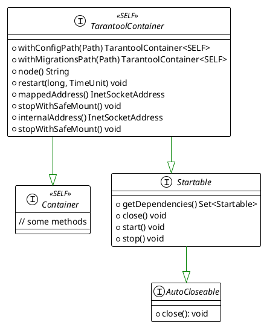
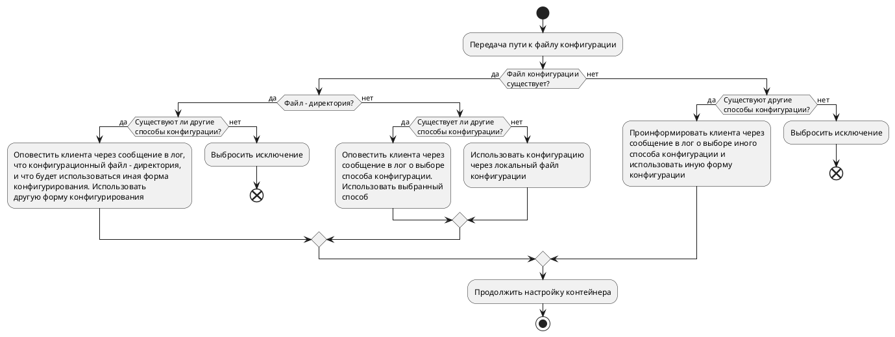
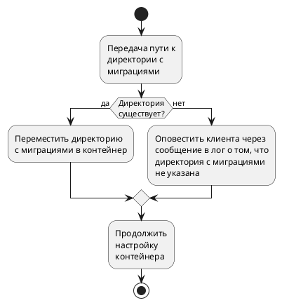

## Архитектура

### TarantoolContainer

Основным интерфейсом для работы с одиночным узлом `Tarantool` является `TarantoolContainer`:



### Требования к реализациям интерфейса

#### Расположение монтируемых директорий и файлов

Все реализации интерфейса должны соответствовать следующим требованиям монтирования директорий и
файлов:

<table>
  <tr>
    <th>Хост</th>
    <th>Контейнер</th>
  </tr>
  <tr>
    <td><pre>
📁 temp_dir/
├─ 📄 config_file
└─ 📁 migration_dir/
    </pre></td>
    <td><pre>
📁 /data/
├─ 📄 config_file
└─ 📁 migration_dir/
    </pre></td>
  </tr>
</table>

Директория `/data` является основной директорией внутри контейнера. Здесь хранится состояние
процесса `Tarantool`, файлы конфигурации и миграции. Монтируемая к `/data` директория на хосте
выбирается произвольно. `TT_WAL_DIR`, `TT_VYNIL_DIR`, `TT_SNAPSHOT_DIR`, `TT_MEMTX_DIR` должны
указывать на директорию `/data`.

#### Передача файла конфигурации

Передача файла конфигурации производится через метод `withConfigPath(Path path)`, где `path` - путь
к файлу конфигурации. Реализации должны соответствовать следующему поведению:



#### Передача файлов-миграций

Директория с миграциями должна соответствовать следующему формату: `<mirations_dir>/scenario`. Файлы
миграций располагаются в директории `scenario` на одном уровне, без вложенности:

```
📁 migrations_dir/
└─ 📁 scenario/
   ├─ 📄 001_migration.lua
   ├─ 📄 002_migration.lua
   ├─    ...
   └─ 📄 00N_migration.lua
```

Путь к директории с миграциями задается через метод `withMigrationsPath(Path path)`. Реализации
должны соответствовать следующему поведению:



Описываемый контракт не налагает требований на обязательную реализацию механизма
применения [миграций](https://www.tarantool.io/en/doc/latest/platform/ddl_dml/migrations/), но
обязывает монтировать директорию с миграциями в контейнер.

#### Перезапуск контейнера

Перезапуск контейнера осуществляется с помощью метода `void restart(long delay, TimeUnit unit)`, где
`delay` - кол-во ожидания, `unit` - определяет единицу измерения `delay`. Реализации должны
обеспечить сохранение монтируемых данных при использовании этого метода.

#### Остановка контейнера

=== "С сохранением монтируемых данных"

    Остановка контейнера с сохранением монтируемых данных (равносильно сохранению состояния 
    `Tarantool`) производится с помощью идемпотентного метода `void stopWithSafeMount()`:

    ```java
    import java.nio.file.Path;
    import java.nio.file.Paths;
    
    import org.junit.Test;
    import org.testcontainers.containers.tarantool.Tarantool3Container;
    import org.testcontainers.containers.tarantool.TarantoolContainer;
    import org.testcontainers.utility.DockerImageName;
    
    public class TestClass {
    
      @Test
      public void testCloseWithSafeMount() {
        final DockerImageName image = DockerImageName.parse("tarantool/tarantool:3.4.1");
        final Path pathToConfigFile = Paths.get("path/to/config.yaml");
    
        try (TarantoolContainer<Tarantool3Container> container = new Tarantool3Container(image,
            "some_node_name")
            .withConfigPath(pathToConfigFile)) {
          container.start(); // valid
          container.start(); // valid. Idempotency.
    
          container.stopWithSafeMount();
          container.stopWithSafeMount(); // idempotency
    
          container.start(); // start again
        } // call `close()` method of AutoCloseable interface
      }
    }
    ```

=== "Без сохранения монтируемых данных"

    ```java
    import java.nio.file.Path;
    import java.nio.file.Paths;
    
    import org.junit.Test;
    import org.testcontainers.containers.tarantool.Tarantool3Container;
    import org.testcontainers.containers.tarantool.TarantoolContainer;
    import org.testcontainers.utility.DockerImageName;
    
    public class TestClass {
    
      @Test
      public void testCloseWithRemoveMount() {
        final DockerImageName image = DockerImageName.parse("tarantool/tarantool:3.4.1");
        final Path pathToConfigFile = Paths.get("path/to/config.yaml");
    
        try (TarantoolContainer<Tarantool3Container> container = new Tarantool3Container(image,
            "some_node_name")
            .withConfigPath(pathToConfigFile)) {
          container.start();
    
          container.stop();
          container.stop(); // valid. Idempotency
    
          // Uncomment to see the exception.
          // container.start(); // invalid. Throws `already closed` exception
        }
      }
    }
    ```

#### Привязка портов

После запуска контейнера, ему присваивается случайно выбранный свободный внешний порт. Реализации
должны гарантировать, что присвоенный порт будет сохранен за контейнером до момента вызова методов
`close()` или `stop()`.
