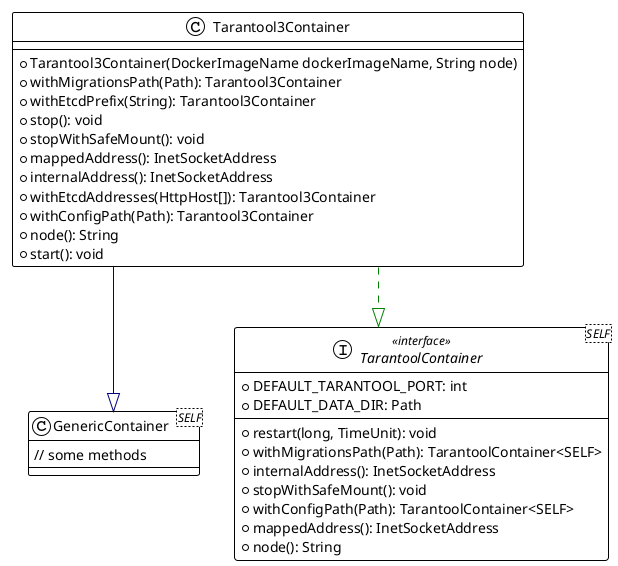
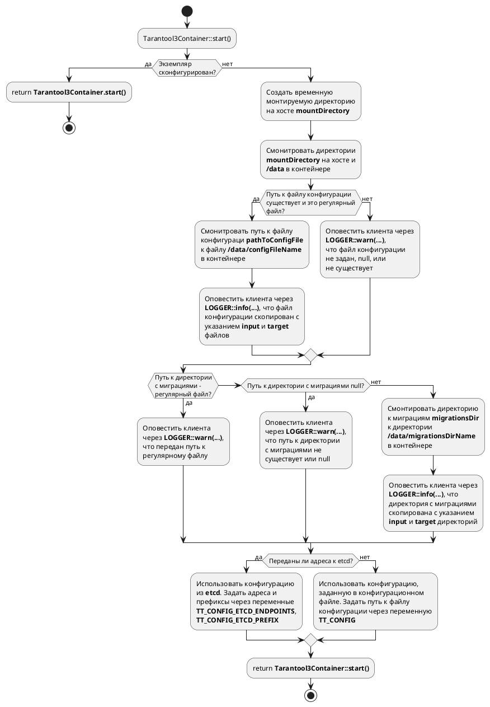

## Стандартная реализация интерфейса `TarantoolContainer`

На странице приводится описание стандартной реализации интерфейса `TarantoolContainer`.

### Диаграмма классов



Класс `Tarantool3Container` позволяет создать объект контейнера `Tarantool 3.x`, удовлетворяющий
[контракту](./single-node-testcontainers-arch.md) `TarantoolContainer`.

### Описание реализации

#### Расположение монтируемых директорий и файлов

Реализация обеспечивает следующее поведение при конфигурировании контейнера:



#### Обеспечение сохранения монтируемых данных

Согласно контракту `TarantoolContainer` при вызове метода `TarantoolContainer::stopWithSafeMount()`
и последующего вызова `TarantoolContainer::start()` монтируемые данные должны сохраниться.
`Tarantool3Container` реализует этот механизм следующим образом:

=== "Tarantool3Container::start()"

    ```puml
    @startuml
    start
    if(Контейнер закрыт через <b>Tarantool3Container::stop()</b>?) then (да)
      :Выбросить исключение;
      end
    else(нет)
      if (Контейнер уже сконфигурирован?) then(да)
      else (no)
        :Сконфигурировать контейнер;
        :Обозначить, что контейнер сконфигурирован;
      endif
    endif
    :return <b>Tarantool3Container::start()</b>;
    stop
    @enduml
    ```

=== "Tarantool3Container::stopWithSafeMount()"

    ```puml
    @startuml
    start
    if(Контейнер закрыт через Tarantool3Container::stop()?) then (да)
    else(нет)
      :Остановить контейнер;
    endif
    :return <b>Tarantool3Container::stopWithSafeMount()</b>;
    stop
    @enduml
    ```

=== "Tarantool3Container::stop()"

    ```puml
    @startuml
    start
    if(Контейнер закрыт через Tarantool3Container::stop()?) then (да)
    else(нет)
      :Удалить монтируемые директории;
      :Остановить контейнер;
      :Обозначит, что контейнер остановлен;
    endif
    :return <b>Tarantool3Container::stop()</b>;
    stop
    @enduml
    ```

Удаление монтируемых директорий происходит только при вызове метода `Tarantool3Container::stop()`.
Конфигурирование контейнера происходит один раз при первом вызове `Tarantool3Container::start()`.

### Привязка портов

На этапе конфигурирования контейнера привязка портов не производится. Привязка портов производится
после запуска контейнера `Tarantool3Container::start()`.
