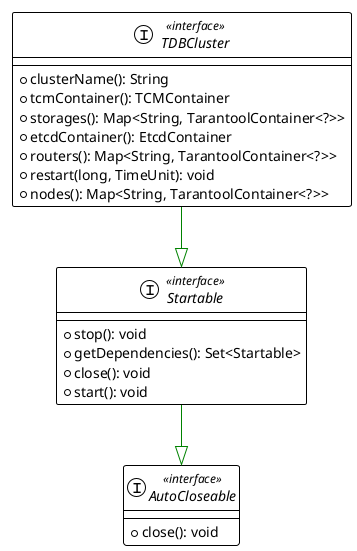
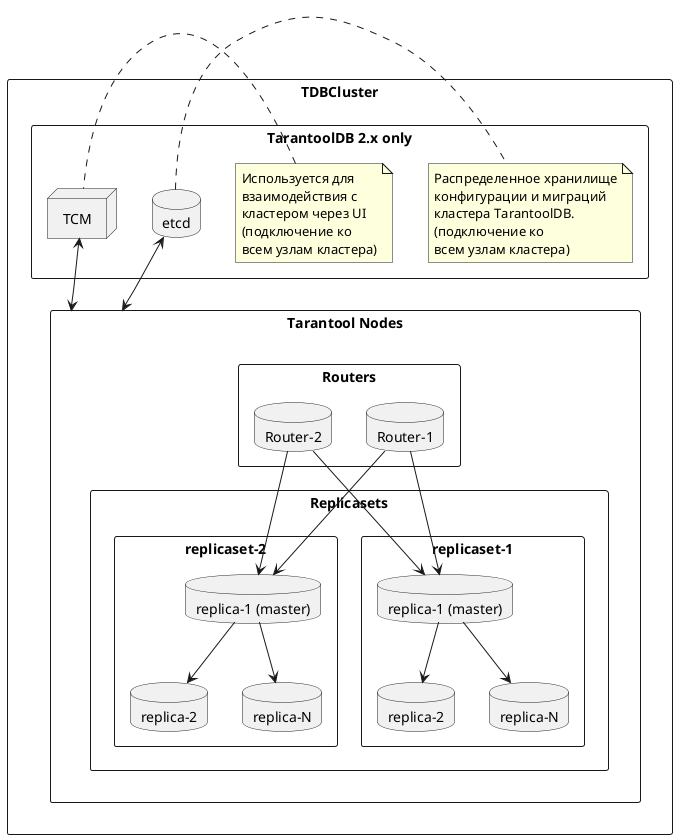

## TDBCluster

Основным интерфейсом для работы с кластером 
[TarantoolDB](https://www.tarantool.io/en/tarantooldb/doc/latest/) в рамках `testcontainers` 
является `TDBCluster`:



## Требования к реализациям интерфейса

### Компоненты кластера TDB

В зависимости от версии `TarantoolDB(TDB)` в кластере могут присутствовать различные
компоненты (контейнеры), необходимые для его работы:



### Перезапуск кластера

Перезапуск кластера осуществляется с помощью метода `void restart(long delay, TimeUnit unit)`, где
`delay` - длительность ожидания, `unit` - определяет единицу измерения `delay`. Реализации должны
обеспечить сохранение монтируемых данных при использовании этого метода.

### Остановка кластера

Остановка кластера с закрытием всех ресурсов производится с помощью методов `stop()`, `close()`:

```java
import org.junit.Test;
import org.testcontainers.containers.tdb.TDBCluster;
import org.testcontainers.utility.DockerImageName;

public class TestClass {

  @Test
  public void method() {
    final DockerImageName image = DockerImageName.parse("tarantooldb:2.2.1");

    try (TDBCluster cluster = new SomeTDBClusterImplementation()) {
      cluster.start();
      cluster.start(); //valid. idempotency

    } // call `close()` method of AutoCloseable interface
  }
}
```

```java

import org.junit.Test;
import org.testcontainers.containers.tdb.TDBCluster;
import org.testcontainers.utility.DockerImageName;

public class TestClass {

  @Test
  public void method() {
    final DockerImageName image = DockerImageName.parse("tarantooldb:2.1.1");

    try (TDBCluster cluster = new SomeTDBClusterImplementation()) {
      cluster.start();

      cluster.stop();
      cluster.stop(); // valid. idempotency
      
      // Uncomment to see the exception
      // cluster.start(); // invalid. Throws `already closed` exception
    }
  }
}
```

### Привязка портов

После запуска кластера, каждому компоненту `TDBCluster` (контейнерам) выделяется свободный
внешний порт. Реализации должны гарантировать, что присвоенные порты будут сохранены за контейнерами
до момента вызова методов `close()` или `stop()`.
