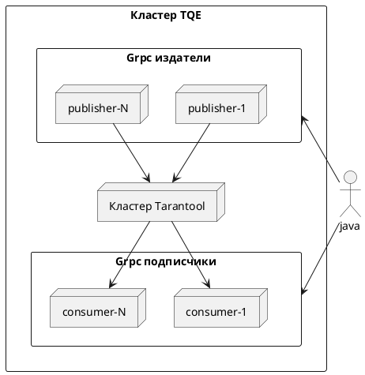

## TQE testcontainers

Архитектура TQE Testcontainers:

`TQE testcontainers` представлены следующими интерфейсами:

- [TarantoolContainer](../single/single-node-testcontainers-arch.md) - используется для создания
  кластера Tarantool
- [GrpcContainer](#grpccontainer) - используется для создания узлов grpc подписчика(consumer)
  /издателя(publisher)
- [TQECluster](#tqecluster) - используется для запуска/перезапуска и остановки кластера TQE
- [TQEConfigurator](#tqeconfigurator) - используется для настройки кластера TQE

### GrpcContainer

`GrpcContainer` - все реализации интерфейса представляют контейнеры, являющиеся grpc-точками. Каждая
точка может иметь одну или две роли подписчик(consumer)/издатель(publisher).

#### GrpcContainerImpl

`GrpcContainerImpl` - базовая реализация [GrpcContainer](#grpccontainer), которая принимает на вход
путь к файлу конфигурации grpc-точек. Путь должен быть регулярным файлом и
соответствовать [правилам](https://www.tarantool.io/ru/queue-enterprise/doc/latest/reference/#configuration)
настройки grpc-точки. Методы запуска и остановки идемпотентны. Объект не хранит состояние.

### TQECluster

`TQECluster` - интерфейс позволяющий управлять TQE кластером. Интерфейс позволяет запускать и
останавливать кластер (после остановки заново запустить кластер с помощью текущего экземпляра
невозможно), перезапускать (с сохранением данных в кластере TQE).

#### TQEClusterImpl

`TQEClusterImpl` - базовая реализация интерфейса [TQECluster](#tqecluster), которая настраивается с
помощью одного из экземпляров [TQEConfigurator](#tqeconfigurator).

### TQEConfigurator

`TQEConfigurator` - интерфейс, позволяющий настраивать узлы TQE
кластер ([grpc-точки](#grpccontainer), [Tarantool кластер](../single/single-node-testcontainers-arch.md)).

#### FileTQEConfigurator

`FileTQEConfigurator` - базовая реализация [TQEConfigurator](#tqeconfigurator), которая позволяет
настроить узлы кластера TQE с помощью конфигурационных файлов. Файлы конфигурации должны быть
регулярными файлами и соответствовать правилам настройки
[grpc-точек и узлов Tarantool для TQE](https://www.tarantool.io/ru/queue-enterprise/doc/latest/reference/#configuration)
